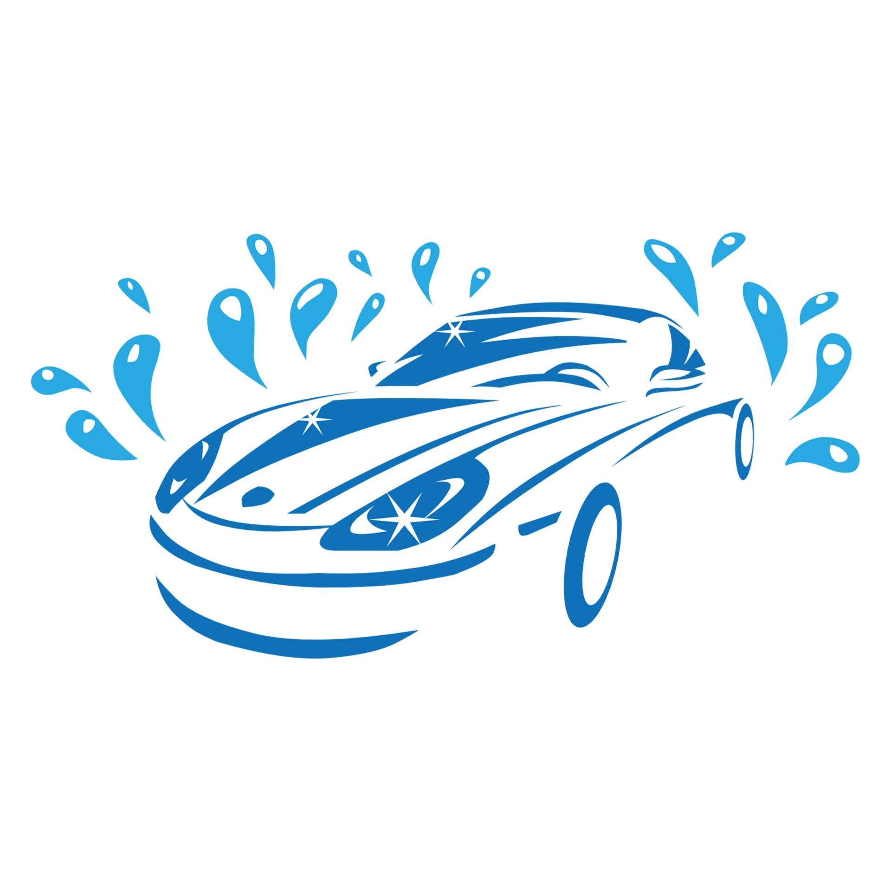
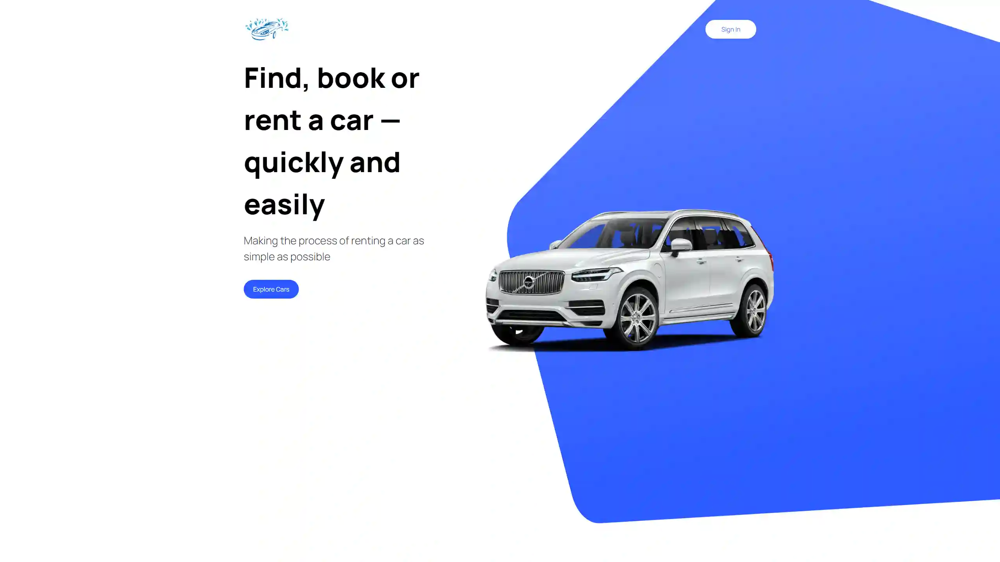
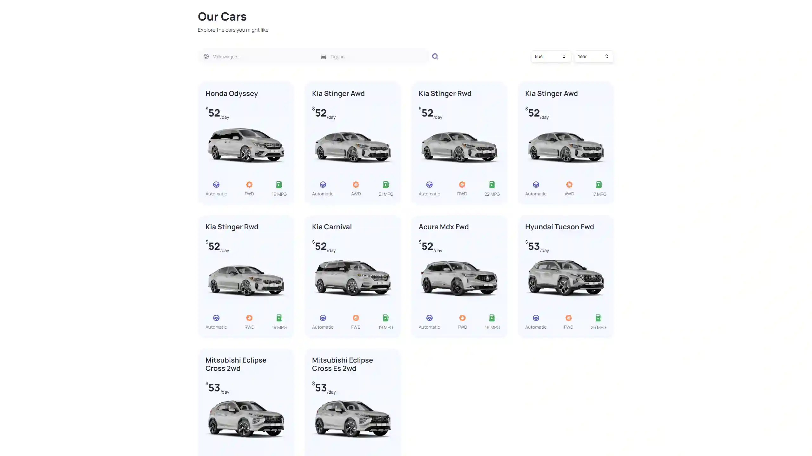
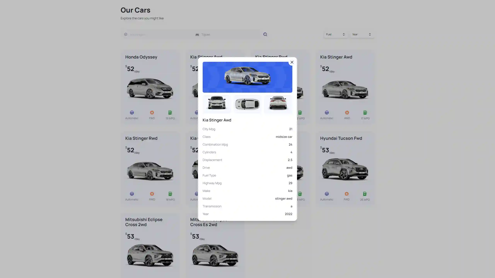

 

  

  <h1 align="center">NextJS Car Rental App</h1>

  

    <a href="https://nextjs-car-rental-rf.vercel.app/"><strong>Live Website »</strong></a>
     
     
  

  
Table of Contents

  <ol>
    <li>
      <a href="#about-project">About Project</a>
    </li>
    <li>
      <a href="#screenshots">Screenshots</a>
    </li>
    <li><a href="#tech-stack">Tech Stack</a></li>
  </ol>

  

## About Project

Car Rental App created using NextJS, React and TypeScript, styled using Tailwind CSS and Headless UI. All the technical data of the cars are fetched from Rapid API, their photos from different angles are also fetched from another API. The site allows you to search for cars by their makes, models and filter the displayed results by fuel type and year of manufacture.

## Screenshots

## Tech Stack

- 
- 
- 
- 
- API
- Headless UI

